## Hi, I'm known as Ng 👋

I am a software engineer by profession and a poet by heart, although I remain unknown. I've been in the software industry for a while and have primarily worked on internal tools for various enterprises. 

While my technical skills help solve complex problems, my poetry provides an outlet for my emotions and thoughts, weaving together the threads of my experiences.

I have a handful of production-grade experiences with **Golang**, **Android**, **Swift**, **JavaScript** applications, **DevOps** releases, and **Kubernetes**. Through this blend of technical proficiency and artistic expression, I strive to bring a unique perspective to every project I undertake. (unique issues as well)

Outside of my 9-5 job, I usually get busy with reading and writing. Lately, I find myself interested in  **Zig**🦎  to begin writing a basic microservice framework for my own needs.

**Recent Projects**

- [zero](https://github.com/im-ng/asciigraph) - Simple opinionated microservice web framework strives for zero allocation and zero memory leak.
- [asciigraph](https://github.com/im-ng/asciigraph) Zig module to flush console ascii line graphs ╭┈╯
- [cronz](https://github.com/im-ng/cronz) Zero allocation task scheduler written in zig